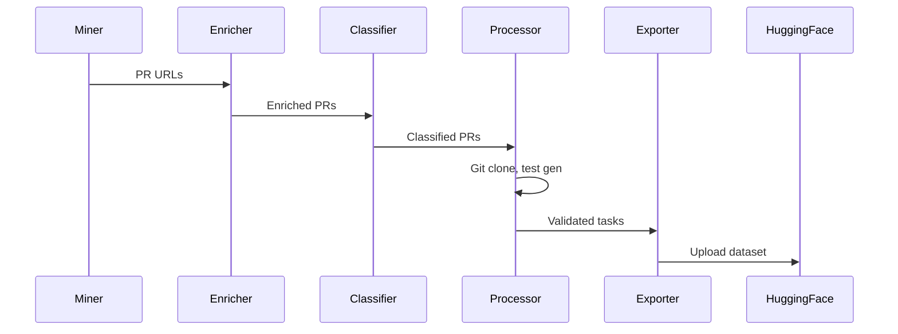

# Architecture

## swe-forge Pipeline

```
GH Archive → Pre-filter → Enrichment → Pre-classify → Deep Processing → Export
    (8x)         (N/A)        (3x)         (10x)           (3x)         (YAML)
```

## Key Components

### 1. Miner (src/swe/miner.rs)
- Fetches GH Archive hourly dumps
- Filters merged PRs from org repos
- Excludes bot PRs
- Output: List of PR URLs

### 2. Enricher (src/swe/enricher.rs)
- Fetches PR metadata via GitHub API
- Gets title, body, diff, changed files
- Rate limited: 5000 req/h

### 3. Pre-classifier (src/swe/classifier.rs)
- LLM-based difficulty classification
- Fast triage on title+body only
- Categories: easy, medium, hard

### 4. Deep Processor (src/swe/processor.rs)
- Git clone + diff extraction
- Agentic test generation (up to 200 turns)
- Quality scoring with LLM
- Fresh-container validation

### 5. Exporter (src/swe/exporter.rs)
- Exports to workspace.yaml
- HuggingFace dataset upload
- Parquet format with ZSTD compression

## Data Flow



## Task Structure

```
tasks/owner-repo-1234/
├── workspace.yaml    # SWE-bench format
└── tests/
    ├── fail_to_pass/  # Test commands
    └── pass_to_pass/  # Test commands
```

## TestRunResult Enum

```rust
pub enum TestRunResult {
    Ok,                    // All tests passed
    RealFailure(String),   // Actual test failure
    EnvironmentBroken(String), // Missing tools/modules
}
```
